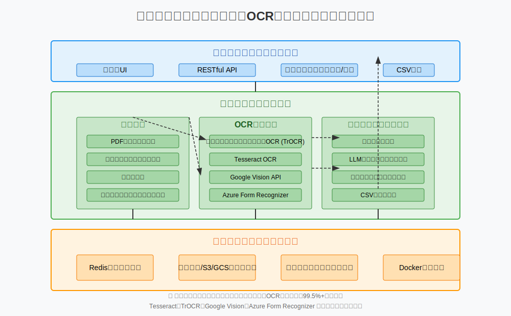

# 超高精度マルチランゲージ OCR システム

日本のビジネス文書向けの超精度 OCR システムであり、複数の OCR エンジンをアンサンブルすることで 99.5% 以上の精度を実現します。

## 主な機能

- **多言語サポート**: 日本語、韓国語、英語、中国語（簡体字／繁体字）に対応
- **PDF 自動向き修正**: 傾きや回転したページを自動検出・補正
- **高精度 OCR**: 複数の OCR エンジンのアンサンブルにより最高レベルの精度を提供
  - **特殊項目認識**: 署名、手書き文字、修正済みテキストなどを認識
  - **アンサンブルアプローチ**: TrOCR、Tesseract、Google Vision、Azure Form Recognizer の組み合わせ
- **LLM ベースのデータ抽出**: 設定可能なフィールドの自動抽出
- **CSV 出力**: 抽出されたデータを CSV として保存
- **ウェブインターフェース**: 直感的なウェブ UI による文書管理と抽出結果の確認

## システムアーキテクチャ



## システム要件

- Python 3.11+
- Redis 6.0+
- Docker および Docker Compose（推奨）
- 最低 8GB RAM
- （オプション）CUDA 11.0+ 対応の NVIDIA GPU

## クイックスタート (Docker)

```bash
# 1. リポジトリのクローン
git clone https://github.com/yourusername/precision-ocr-system.git
cd precision-ocr-system

# 2. 環境変数の設定
cp .env.example .env
# .env ファイルを編集して API キー等を設定

# 3. Docker で実行
docker-compose up -d

# 4. ウェブアクセス（ブラウザで）
# http://localhost:8000
```

## 手動インストール

<details>
<summary>詳細なインストール手順を表示</summary>

### 1. 事前要件

Ubuntu 20.04 LTS のインストール例:

```bash
# システムパッケージのインストール
apt-get update
apt-get install -y \
    python3 python3-pip python3-dev \
    tesseract-ocr libtesseract-dev \
    tesseract-ocr-jpn tesseract-ocr-kor tesseract-ocr-chi-sim tesseract-ocr-chi-tra \
    mecab libmecab-dev mecab-ipadic-utf8 \
    redis-server \
    build-essential

# 日本語 MeCab 辞書のインストール
git clone --depth 1 https://github.com/neologd/mecab-ipadic-neologd.git
cd mecab-ipadic-neologd
./bin/install-mecab-ipadic-neologd -n -y
cd ..
```

### 2. アプリケーションのインストール

```bash
# リポジトリのクローン
git clone https://github.com/yourusername/precision-ocr-system.git
cd precision-ocr-system

# 仮想環境の作成（オプション）
python3 -m venv venv
source venv/bin/activate

# パッケージのインストール
pip install -r requirements.txt

# 環境変数の設定
cp .env.example .env
# .env ファイルを編集して設定

# OCR モデルのダウンロード
python -m scripts.download_models
```

### 3. アプリケーションの実行

```bash
# Redis サーバーの起動（既に実行中でない場合）
redis-server &

# バックグラウンドワーカーの起動
python -m src.worker.start

# API サーバーの起動
python main.py
```

### 4. ウェブアクセス
ブラウザで `http://localhost:8000` にアクセスしてください。

</details>

## 使用方法

### ウェブインターフェースの使用

1. **ログイン**: システムにログイン（初期アカウント：admin/admin）
2. **文書アップロード**: 「新規文書アップロード」ボタンをクリックして PDF または画像ファイルをアップロード
3. **処理待ち**: OCR 処理が完了するまで待機（処理状況をリアルタイムで確認可能）
4. **結果確認**: 処理完了後、抽出されたテキスト結果を確認
5. **フィールド抽出**: 「データ抽出」タブで抽出されたキー・バリューの確認および編集
6. **CSV 出力**: 「エクスポート」ボタンで抽出データを CSV として保存

### 設定ページ

「設定」メニューでは、以下の項目を構成できます:

1. **抽出フィールド設定**:
   - フィールド名（例: "invoice_number", "date", "total_amount"）
   - フィールドタイプ（テキスト、日付、金額、会社名など）
   - 抽出コンテキスト（そのフィールド付近に表示されるテキスト）
   - 正規表現パターン（該当する場合）

2. **OCR エンジン設定**:
   - 使用する OCR エンジンの選択
   - エンジンごとの重み付け調整
   - 信頼度の閾値設定

3. **処理オプション**:
   - 画像前処理設定
   - 後処理オプション
   - キャッシュ設定

## API の使用

RESTful API を通じて、システムをプログラム的に利用できます:

```bash
# 文書の OCR 処理リクエスト
curl -X POST \
  -F "file=@your_document.pdf" \
  -F "options={\"language\":\"jpn\", \"extract_entities\":true}" \
  http://localhost:8000/api/v1/ocr

# 処理結果の確認
curl http://localhost:8000/api/v1/ocr/{task_id}

# 抽出フィールド設定の取得
curl http://localhost:8000/api/v1/extraction/fields

# CSV 出力
curl -X GET \
  -o extracted_data.csv \
  http://localhost:8000/api/v1/extraction/{task_id}/csv
```

## ディレクトリ構造

```
ocr-service/
├── src/                   # ソースコード
│   ├── api/               # API 関連コード
│   ├── core/              # コア機能および設定
│   ├── ocr/               # OCR エンジンおよび処理
│   ├── document/          # 文書処理
│   ├── extraction/        # LLM ベースのデータ抽出
│   ├── storage/           # ストレージ管理
│   ├── utils/             # ユーティリティ関数
│   ├── web/               # ウェブ UI
│   └── worker/            # バックグラウンドワーカー
├── models/                # OCR モデル保管場所
├── configs/               # 設定ファイル
├── scripts/               # ユーティリティスクリプト
├── docker/                # Docker 構成
├── tests/                 # テストコード
├── .env.example           # 環境変数例
├── requirements.txt       # Python パッケージ
├── docker-compose.yml     # Docker Compose 設定
├── Dockerfile             # Dockerfile
└── main.py                # アプリケーションエントリーポイント
```

## 拡張性とパフォーマンス

- **水平スケーリング**: Docker Swarm や Kubernetes を利用して複数のワーカーノードで拡張可能
- **分散処理**: Redis ワークキューによる効率的なタスク分散
- **キャッシュ**: 画像ハッシュを用いたキャッシュにより再処理を防止
- **バッチ処理**: 大量文書の効率的な処理を実現

## トラブルシューティング

<details>
<summary>よくある問題</summary>

### インストールの問題

- **Tesseract エラー**: `apt-get install tesseract-ocr` コマンドで再インストールを実施
- **MeCab 辞書エラー**: `mecab-ipadic-neologd` 辞書の手動インストールを確認
- **Redis 接続エラー**: Redis サーバーが起動しているか確認（`redis-cli ping` を実行）

### パフォーマンスの問題

- **メモリ不足**: `docker-compose.yml` 内のメモリ制限を増加
- **処理速度が遅い**: GPU サポートの有効化やバッチサイズの調整を検討
- **OCR 精度が低い**: 特定の文書タイプに合わせたアンサンブルの重み付け調整を実施

### 一般的なエラー

- **ファイル形式エラー**: サポートされているファイル形式（PDF, JPG, PNG）を使用
- **API キーエラー**: `.env` ファイルで Google/Azure API キーを確認
- **言語検出の失敗**: 手動で言語を指定する（`language` オプションを使用）

</details>

## ライセンス

MIT License - 詳細は [LICENSE](LICENSE) ファイルを参照してください。

## 貢献方法

1. イシューの報告または機能リクエスト
2. プルリクエストの提出
3. コードレビューへの参加
